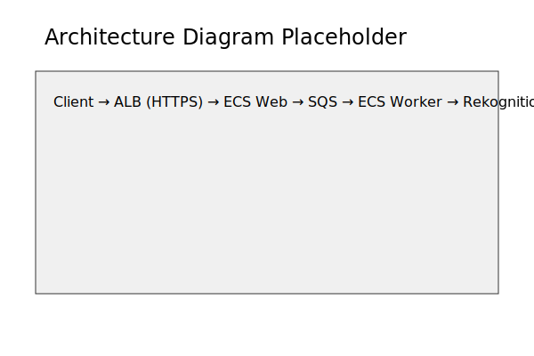

# AWS Cloud Image Recognition Service

A container-based, queue-driven, fully-instrumented image-recognition service on AWS using ECS, SQS, S3, and Terraform.

## Architecture

## Project Structure
- `app-web`: Spring Boot web API for image upload
- `app-worker`: Spring Boot worker for image processing
- `iac`: Infrastructure as Code (Terraform)
- `docs`: Documentation
- `.github`: CI/CD workflows

## Quick Start
1. Clone the repo
2. Run locally with LocalStack and Docker Compose
3. Deploy to AWS with one command: `terraform apply`

## Badges
<!-- Add build, deploy, and license badges here --> 